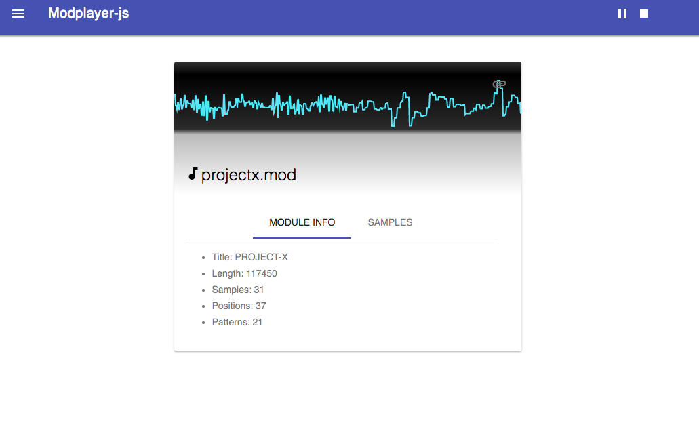

# modplayer-js
JavaScript player for SoundTracker/Noisetracker mod files using the webaudio [AudioWorklet](https://developers.google.com/web/updates/2017/12/audio-worklet) API.



For a demo, head over [here](https://warpdesign.github.io/modplayer-js/).

# What's implemented

Amiga 4 channel Sountracker/Noisetracker mod files with 4 channels and 15-31 instruments are supported.

The following note effects are supported:

 - Slide up (0x1)
 - Slide down (0x2)
 - Portamento / slide to note (0x3)
 - Sample offset (0x9)
 - Volume slide (0xA)
 - Channel volume (0xC)
 - Row jump (0xD)
 - Retrigger note (0xE9)
 - Set speed (0xF)


# Dependencies

ModPlayer JS makes use of the following piece of software:

 - The User Interface is built using [Material Design Lite](https://getmdl.io)
 - The [AudioWorklet polyfill](https://github.com/GoogleChromeLabs/audioworklet-polyfill) is used to stay compatible with browsers that do not support it yet
 - Spectrum display is based on [Audio DSP Background](https://github.com/acarabott/audio-dsp-playground) by [@Acarabott](https://github.com/acarabott)

# Module files copyright

ModPlayer-js includes the following module files:

 - agony.mod: music from Amiga game [Agony](https://www.youtube.com/watch?v=iRzIpghJeec) by [Tim Wright](https://twitter.com/CoLDSToRAGE)
 - all_that_she_wants.mod: Ace of Base remix from 1993 by Crossair
 - bigtime.mod: Björk Big Time Sensuality remix from 1994 by ISO from Axis group, appeared in the [Big Time Sensuality demo](https://www.youtube.com/watch?v=Y-2xUXk5F2w)
 - cannonfodder.mod: music from [Cannon Fodder](https://www.youtube.com/watch?v=PiYuq6Ac3a0) Amiga game by [John Hare](https://twitter.com/johnhare) / [Richard Joseph](https://en.wikipedia.org/wiki/Richard_Joseph)
 - desert_strike: music from [Desert Strike](https://www.youtube.com/watch?v=hcJaph0D7UM) Amiga game by Jason Whitley
 - LotusII.mod: music from [Lotus II](https://www.youtube.com/watch?v=vETonlaTZ4c) game by [Barry Leitch](https://en.wikipedia.org/wiki/Barry_Leitch)
 - projectx.mod: music from [Project-X](https://www.youtube.com/watch?v=gjq-ONi3dZE) Amiga game by [Allister Brimble](https://twitter.com/allisterbrimble)
 - silkworm.mod: music from [Silkworm](https://www.youtube.com/watch?v=4wNidIucUuc) Amiga game by [Barry Leitch](https://en.wikipedia.org/wiki/Barry_Leitch)

# Module background

Modules are like MIDI files but with custom sound samples instead of builtin synth files.

Modules produce sound by playing included samples at a specific rate: this simulates the concept of note. Even though included sounds are encoded at a specific rate, this information isn't saved into the module file.

Instead of playing at a specific rate, a `period` is used during which the same sample is played. This is directly reminiscent of the Amiga's hardware and more specfically the Paula sound chip which is responsible for playing sound in the Amiga.

To reproduce the original sound the mod creator has to play it at the note which would play it at the same rate as it was encoded.

Soundtracker modules have 4 voices which can be independentaly played with a specific period and volume.

In addition to the notion of period, there is a speed at which tracks are played which was again close to the Amiga's hardware because it was synced to the monitor's refresh rate: 50hz for PAL and 60hz for NTSC.

This formula gives the speed:

```
7093789.2 / ((period * 2) * mixingRate)
```

# Module files today

Original Soundtracker mod files only supported 4 channels and 15 instruments. Sample length was limited to 9,999 bytes and sample resolution was only 8bit but it was quickly extended to support 31 instruments and no special limit on sample length.

With the advent of PC sound cards with better sound capabilites (Gravis Ultra Sound could mix as many as 32 channels in hardware in 1993), the mod format was extended with more channels, more effects, 16 bit samples...

New formats were also created: S3M, IT,...

Even though its use is very limited today thanks to virtually unlimited computing power and storage size, it's amazing what can be done with only module files.

That's why it's still in use today: mostly in the `demo scene`, and in some rare games.

# Module format

The original Sountracker format is quite simple: it starts by listing the mod's title, padded to 20 ASCII characters: there isn't even a magic number.

Then samples information is stored:

Offset | Information | Size (bytes)
--- | --- | ---
0 | Sample name | 22
22 | Sample Length | 2
24 | Finetune | 1
25 | Volume | 1
26 | Repeat Start | 2
28 | Repeat End | 2

Then comes the patterns data: first the list of positions and then each patterns information which is encoded: each note information takes 4 bytes. Since there are 64 rows and 4 channels, this means a pattern takes exactly `64 * 4 * 4 = 1024 bytes`.

Last but not least, sample data is stored, uncompressed in LPCM 8bit format.

More information can be found in the [original specs](https://github.com/cmatsuoka/tracker-history/blob/master/reference/amiga/soundtracker/Soundtracker_v1-v9/Soundtracker_v2.doc) file (which was written in 1988: ouch!).
